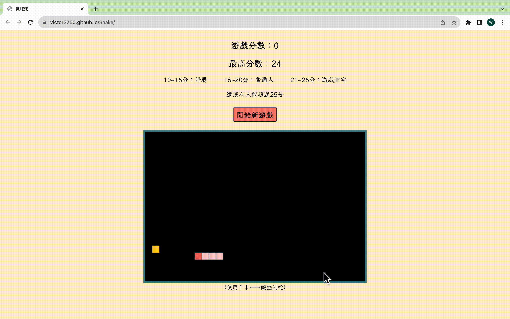

# 貪吃蛇
DEMO:[https://victor3750.github.io/Snake/](https://victor3750.github.io/Snake/)
  
遊戲說明：蛇可以穿牆（從另一側出現），隨著分數越高會逐漸加快蛇的移動速度

# 設計邏輯
## 蛇的移動
將蛇的每一個部位儲存成物件，其中存放該部位在canvas上的x、y座標，並將所有物件存為一個陣列，利用setInterval不斷執行以下動作：
  
1. Array.pop => 刪除蛇尾
  
2. Array.unshift => 放入新的蛇頭座標

3. 同時透過canvas重新繪製整條蛇，以此達到蛇在移動的視覺效果
## 分數
* 利用localStorage儲存最高分數

* 以5分為一個區間，每提升一個區間便透過縮短setInterval的間隔加快蛇的移動速度，增加遊戲難度

* 當達到遊戲上方指定的分數，透過DOM操作將其標示出來，增加互動性
